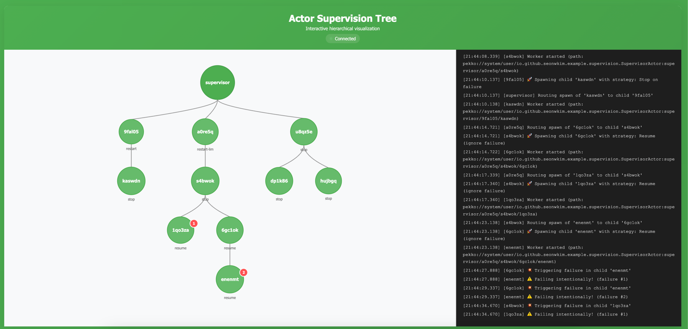

<table>
<tr>
<td width="15%">
  
</td>
<td>
  <h2>Spring Boot Starter Actor</h2>
  <p>Bring the power of the actor model to your Spring Boot applications using <a href="https://pekko.apache.org/">Pekko</a> (an open-source fork of Akka).</p>
</td>
</tr>
</table>

## Why spring-boot-starter-actor?

This library brings Pekko actors to Spring Boot. Build scalable, concurrent systems—real-time chat, IoT platforms, event processing—using familiar Spring patterns.

**Key Features:**
- Auto-configuration with Spring Boot
- Full Spring dependency injection support
- Local and cluster mode support
- Built-in metrics and monitoring

<div style="border: 2px solid #ccc; display: inline-block; border-radius: 8px; overflow: hidden; margin: 20px 0;">
  
</div>

## Installation

### Prerequisites
- Java 11 or higher
- Spring Boot 2.x or 3.x

### Dependency Setup

Add the dependency to your project:

**Gradle:**
```gradle
dependencyManagement {
    imports {
        // Pekko requires Jackson 2.17.3+
        mavenBom("com.fasterxml.jackson:jackson-bom:2.17.3")
    }
}

// Spring Boot 2.7.x
implementation 'io.github.seonwkim:spring-boot-starter-actor:0.1.0'

// Spring Boot 3.2.x
implementation 'io.github.seonwkim:spring-boot-starter-actor_3:0.1.0'
```

**Maven:**
```xml
<dependencyManagement>
  <dependencies>
    <dependency>
      <groupId>com.fasterxml.jackson</groupId>
      <artifactId>jackson-bom</artifactId>
      <version>2.17.3</version>
      <type>pom</type>
      <scope>import</scope>
    </dependency>
  </dependencies>
</dependencyManagement>

<!-- Spring Boot 2.7.x -->
<dependency>
  <groupId>io.github.seonwkim</groupId>
  <artifactId>spring-boot-starter-actor</artifactId>
  <version>0.1.0</version>
</dependency>

<!-- Spring Boot 3.2.x -->
<dependency>
  <groupId>io.github.seonwkim</groupId>
  <artifactId>spring-boot-starter-actor_3</artifactId>
  <version>0.1.0</version>
</dependency>
```

Latest versions: [spring-boot-starter-actor](https://central.sonatype.com/artifact/io.github.seonwkim/spring-boot-starter-actor) | [spring-boot-starter-actor_3](https://central.sonatype.com/artifact/io.github.seonwkim/spring-boot-starter-actor_3)

### Enable Actor Support

Add `@EnableActorSupport` to your application:

```java
@SpringBootApplication
@EnableActorSupport
public class MyApplication {
    public static void main(String[] args) {
        SpringApplication.run(MyApplication.class, args);
    }
}
```

## Quick Start

### Basic Setup

Add `@EnableActorSupport` and start creating actors:

```java
@SpringBootApplication
@EnableActorSupport
public class Application {
    public static void main(String[] args) {
        SpringApplication.run(Application.class, args);
    }
}
```

### Simple Actor Example

Create an actor by implementing `SpringActor`:

```java
@Component
public class GreeterActor implements SpringActor<GreeterActor.Command> {

    public interface Command {}

    public record Greet(String name, ActorRef<String> replyTo) implements Command {}

    @Override
    public SpringActorBehavior<Command> create(SpringActorContext actorContext) {
        return SpringActorBehavior.builder(Command.class, actorContext)
            .onMessage(Greet.class, (ctx, msg) -> {
                msg.replyTo.tell("Hello, " + msg.name + "!");
                return Behaviors.same();
            })
            .build();
    }
}
```

### Using Actors in Services

Inject `SpringActorSystem` and use it to interact with actors:

```java
@Service
public class GreeterService {
    private final SpringActorSystem actorSystem;

    public GreeterService(SpringActorSystem actorSystem) {
        this.actorSystem = actorSystem;
    }

    public CompletionStage<String> greet(String name) {
        return actorSystem.actor(GreeterActor.class)
            .withId("greeter")
            .spawn()
            .thenCompose(actor -> actor
                .askBuilder(replyTo -> new GreeterActor.Greet(name, replyTo))
                .withTimeout(Duration.ofSeconds(5))
                .execute()
            );
    }
}
```

### Actor Lifecycle Operations

**Create and Start an Actor:**
```java
// Start a new actor instance
CompletionStage<SpringActorRef<Command>> actorRef = actorSystem
    .actor(MyActor.class)
    .withId("my-actor-1")
    .withTimeout(Duration.ofSeconds(5))  // Optional: custom timeout
    .spawn();
```

**Get Reference to Existing Actor:**
```java
// Get an existing actor (returns null if not found)
CompletionStage<SpringActorRef<Command>> actorRef = actorSystem
    .get(MyActor.class, "my-actor-1");

// With custom timeout
actorRef = actorSystem.get(MyActor.class, "my-actor-1", Duration.ofMillis(500));
```

**Get or Create Actor (Recommended):**
```java
// Simplified approach - automatically gets existing or spawns new actor
CompletionStage<SpringActorRef<Command>> actorRef = actorSystem
    .getOrSpawn(MyActor.class, "my-actor-1");

// With custom timeout
actorRef = actorSystem.getOrSpawn(MyActor.class, "my-actor-1", Duration.ofSeconds(5));
```

**Check if Actor Exists:**
```java
// Check if actor is running
CompletionStage<Boolean> exists = actorSystem
    .exists(MyActor.class, "my-actor-1");

// With custom timeout
exists = actorSystem.exists(MyActor.class, "my-actor-1", Duration.ofMillis(500));
```

**Stop an Actor:**
```java
// Stop a running actor
actorRef.thenAccept(actor -> actor.stop());
```

## Core Concepts

### Communication Patterns

**Fire-and-forget (tell):**
```java
actor.tell(new ProcessOrder("order-123"));
```

**Request-response (ask):**
```java
CompletionStage<String> response = actor
    .askBuilder(GetValue::new)
    .withTimeout(Duration.ofSeconds(5))
    .execute();
```

**With error handling:**
```java
CompletionStage<String> response = actor
    .askBuilder(GetValue::new)
    .withTimeout(Duration.ofSeconds(5))
    .onTimeout(() -> "default-value")
    .execute();
```

### Sharded Actors (Cluster Mode)

For distributed systems, use sharded actors. Entities are automatically created on-demand and distributed across cluster nodes:

**Define a Sharded Actor:**
```java
@Component
public class UserSessionActor implements SpringShardedActor<UserSessionActor.Command> {

    public static final EntityTypeKey<Command> TYPE_KEY =
        EntityTypeKey.create(Command.class, "UserSession");

    public interface Command extends JsonSerializable {}

    public record UpdateActivity(String activity) implements Command {}
    public record GetActivity(ActorRef<String> replyTo) implements Command {}

    @Override
    public EntityTypeKey<Command> typeKey() {
        return TYPE_KEY;
    }

    @Override
    public SpringShardedActorBehavior<Command> create(EntityContext<Command> ctx) {
        return SpringShardedActorBehavior.builder(Command.class, ctx)
            .onCreate(entityCtx -> new UserSessionBehavior(ctx.getEntityId()))
            .onMessage(UpdateActivity.class, UserSessionBehavior::onUpdateActivity)
            .onMessage(GetActivity.class, UserSessionBehavior::onGetActivity)
            .build();
    }

    private static class UserSessionBehavior {
        private final String userId;
        private String activity = "idle";

        UserSessionBehavior(String userId) {
            this.userId = userId;
        }

        Behavior<Command> onUpdateActivity(UpdateActivity msg) {
            this.activity = msg.activity;
            return Behaviors.same();
        }

        Behavior<Command> onGetActivity(GetActivity msg) {
            msg.replyTo.tell(activity);
            return Behaviors.same();
        }
    }
}
```

**Using Sharded Actors:**
```java
// Fire-and-forget messaging
SpringShardedActorRef<Command> actor = actorSystem
    .sharded(UserSessionActor.class)
    .withId("user-123")
    .get();

actor.tell(new UpdateActivity("logged-in"));

// Request-response messaging
CompletionStage<String> activity = actor
    .askBuilder(GetActivity::new)
    .withTimeout(Duration.ofSeconds(5))
    .execute();

// With error handling
CompletionStage<String> activityWithFallback = actor
    .askBuilder(GetActivity::new)
    .withTimeout(Duration.ofSeconds(5))
    .onTimeout(() -> "unknown")
    .execute();
```

**Key Differences from Regular Actors:**
- Sharded actors are created **automatically** when first message arrives (no `start()` needed)
- Entity references are always valid, even if the entity isn't currently running
- Entities are automatically distributed across cluster nodes
- Entities are passivated after idle timeout (configurable)
- Use `get()` to obtain a reference (not `start()`)

### Spring Dependency Injection

Actors are Spring components, so constructor injection works:

```java
@Component
public class OrderActor implements SpringActor<OrderActor.Command> {

    private final OrderRepository orderRepository;

    public OrderActor(OrderRepository orderRepository) {
        this.orderRepository = orderRepository;
    }

    public interface Command {}
    public record ProcessOrder(String orderId) implements Command {}

    @Override
    public SpringActorBehavior<Command> create(SpringActorContext actorContext) {
        return SpringActorBehavior.builder(Command.class, actorContext)
            .onMessage(ProcessOrder.class, (ctx, msg) -> {
                Order order = orderRepository.findById(msg.orderId);
                return Behaviors.same();
            })
            .build();
    }
}
```

### Configuration

**Local mode** (default):
```yaml
spring:
  actor:
    pekko:
      actor:
        provider: local
```

**Cluster mode:**
```yaml
spring:
  actor:
    pekko:
      actor:
        provider: cluster
      remote:
        artery:
          canonical:
            hostname: "127.0.0.1"
            port: 2551
      cluster:
        seed-nodes:
          - "pekko://MyActorSystem@127.0.0.1:2551"
```

## Advanced Features

### Supervision and Fault Tolerance

Spring Boot Starter Actor provides robust supervision strategies for building self-healing, fault-tolerant systems. When a child actor fails, its parent supervisor can decide how to handle the failure using different strategies.

#### Available Supervision Strategies

**1. Restart Strategy (Default)**
```java
// Restart the actor on failure (default behavior)
SupervisorStrategy strategy = SupervisorStrategy.restart();
```

**2. Restart with Limit**
```java
// Restart up to 3 times within 1 minute, then stop
SupervisorStrategy strategy = SupervisorStrategy.restart()
    .withLimit(3, Duration.ofMinutes(1));
```

**3. Stop Strategy**
```java
// Stop the actor on failure
SupervisorStrategy strategy = SupervisorStrategy.stop();
```

**4. Resume Strategy**
```java
// Ignore the failure and resume processing
SupervisorStrategy strategy = SupervisorStrategy.resume();
```

#### Spawning Top-Level Actors with Supervision

You can apply supervision strategies when spawning actors from `SpringActorSystem`:

```java
@Service
public class MyService {
    private final SpringActorSystem actorSystem;

    public MyService(SpringActorSystem actorSystem) {
        this.actorSystem = actorSystem;
    }

    public CompletionStage<SpringActorRef<Command>> createSupervisedActor() {
        // Spawn actor with restart strategy
        return actorSystem.actor(WorkerActor.class)
            .withId("worker-1")
            .withSupervisonStrategy(SupervisorStrategy.restart().withLimit(3, Duration.ofMinutes(1)))
            .spawn();
    }
}
```

#### Spawning Child Actors with Supervision

Within an actor, use the fluent builder API to spawn supervised child actors:

```java
@Component
public class SupervisorActor implements SpringActor<SupervisorActor.Command> {

    public interface Command extends FrameworkCommand {}

    @Override
    public SpringActorBehavior<Command> create(SpringActorContext actorContext) {
        return SpringActorBehavior.builder(Command.class, actorContext)
            .onMessage(DelegateWork.class, (ctx, msg) -> {
                // Use SpringActorRef to spawn/manage children with fluent API
                SpringActorRef<Command> self = new SpringActorRef<>(ctx.getSystem().scheduler(), ctx.getSelf());

                // Fluent API for spawning children
                self.child(WorkerActor.class)
                    .withId("worker-1")
                    .withSupervisionStrategy(SupervisorStrategy.restart())
                    .withTimeout(Duration.ofSeconds(5))
                    .spawn();  // Returns CompletionStage<SpringActorRef>

                // Or use spawnAndWait() for synchronous spawning
                SpringActorRef<WorkerActor.Command> worker = self.child(WorkerActor.class)
                    .withId("worker-2")
                    .withSupervisionStrategy(SupervisorStrategy.restart().withLimit(3, Duration.ofMinutes(1)))
                    .spawnAndWait();

                return Behaviors.same();
            })
            .build();
    }
}
```

**Child Actor Builder Operations:**

```java
// Spawn a new child
CompletionStage<SpringActorRef<Command>> child = parentRef
    .child(ChildActor.class)
    .withId("child-1")
    .withSupervisionStrategy(SupervisorStrategy.restart())
    .spawn();

// Get existing child (returns null if not found)
CompletionStage<SpringActorRef<Command>> existing = parentRef
    .child(ChildActor.class)
    .withId("child-1")
    .get();

// Check if child exists
CompletionStage<Boolean> exists = parentRef
    .child(ChildActor.class)
    .withId("child-1")
    .exists();

// Get existing or spawn new (recommended)
CompletionStage<SpringActorRef<Command>> childRef = parentRef
    .child(ChildActor.class)
    .withId("child-1")
    .getOrSpawn();
```

#### Interactive Demo

The supervision example includes an interactive demo that visualizes actor hierarchies and demonstrates real-time failure handling:

<div style="border: 2px solid #ccc; display: inline-block; border-radius: 8px; overflow: hidden; margin: 20px 0;">
  
</div>

Learn more in the [Supervision Guide](https://seonwkim.github.io/spring-boot-starter-actor/examples/supervision/).

### Spring Boot 3 Support

This library fully supports both Spring Boot 2.7.x and 3.2.x:

**Spring Boot 2.7.x:**
```gradle
implementation 'io.github.seonwkim:spring-boot-starter-actor:0.1.0'
```

**Spring Boot 3.2.x:**
```gradle
implementation 'io.github.seonwkim:spring-boot-starter-actor_3:0.1.0'
```

The API is identical across both versions. Simply choose the appropriate artifact based on your Spring Boot version. The `_3` suffix indicates Boot 3 compatibility.

## Running Examples

### Chat Application (Distributed)

```bash
# Start 3-node cluster on ports 8080, 8081, 8082
$ sh cluster-start.sh chat io.github.seonwkim.example.SpringPekkoApplication 8080 2551 3

# Stop cluster
$ sh cluster-stop.sh
```

Or use Docker:
```bash
cd example/chat
sh init-local-docker.sh

# Access at http://localhost:8080, 8081, 8082
# View logs: docker-compose logs -f chat-app-0
# Stop: docker-compose down
```

## Monitoring

Built-in Prometheus metrics and Grafana dashboards:

```bash
cd scripts/monitoring
docker-compose up -d
```

Access:
- **Prometheus**: http://localhost:9090
- **Grafana**: http://localhost:3000 (admin/admin)


## Contributing

Contributions welcome! Please:

1. Create an issue describing your contribution
2. Open a PR with clear explanation
3. Run `./gradlew spotlessApply` for formatting
4. Ensure tests pass

## Documentation

Full documentation: [https://seonwkim.github.io/spring-boot-starter-actor/](https://seonwkim.github.io/spring-boot-starter-actor/)

## License

This project is licensed under the Apache License 2.0.
