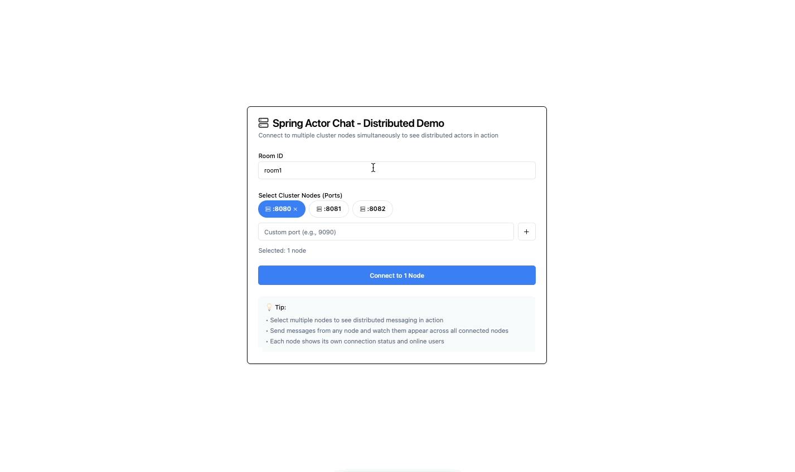

<div style="text-align: center; margin-top: 30px;">
  
</div>

# Spring Boot Starter Actor

A library that integrates Spring Boot with the actor model using [Pekko](https://pekko.apache.org/) (an
open-source, community-driven fork of Akka).

<div style="border: 2px solid #ccc; display: inline-block; border-radius: 8px; overflow: hidden;">
  
</div>


## Documentation

For comprehensive documentation, visit our [Documentation Site](https://seonwkim.github.io/spring-boot-starter-actor/).

## Core Concepts

This project bridges the gap between Spring Boot and the actor model, allowing developers to build stateful
applications using familiar Spring Boot patterns while leveraging the power of the actor model for managing
state and concurrency.

The actor model is a programming paradigm that:
- Encapsulates logic and state into actors
- Communicates by sending messages between actors
- Provides natural isolation and concurrency control

## Key Features

- Auto-configure Pekko with Spring Boot
- Seamless integration with Spring's dependency injection
- Support for both local and cluster modes
- Easy actor creation and management
- Spring-friendly actor references

## Quick Start

### Prerequisites

- Java 11 or higher
- Spring Boot 2.x or 3.x

### Installation

Add the dependency to your project:

```gradle
// Manually overwrite spring managed jackson dependency 
dependencyManagement {
	imports {
		// pekko-serialization-jackson_3 require minimum 2.17.3 version of jackson
		mavenBom("com.fasterxml.jackson:jackson-bom:2.17.3")
	}
}

// Gradle (Spring Boot 2.7.x)
implementation 'io.github.seonwkim:spring-boot-starter-actor:0.0.38'

// Gradle (Spring Boot 3.2.x)
implementation 'io.github.seonwkim:spring-boot-starter-actor_3:0.0.38'
```

```xml
<dependencyManagement>
  <dependencies>
    <!-- Override Spring Boot's jackson-bom with 2.17.3 -->
    <dependency>
      <groupId>com.fasterxml.jackson</groupId>
      <artifactId>jackson-bom</artifactId>
      <version>2.17.3</version>
      <type>pom</type>
      <scope>import</scope>
    </dependency>
  </dependencies>
</dependencyManagement>

<!-- Maven (Spring Boot 2.7.x) -->
<dependency>
  <groupId>io.github.seonwkim</groupId>
  <artifactId>spring-boot-starter-actor</artifactId>
  <version>0.0.38</version>
</dependency>

<!-- Maven (Spring Boot 3.2.x) -->
<dependency>
  <groupId>io.github.seonwkim</groupId>
  <artifactId>spring-boot-starter-actor_3</artifactId>
  <version>0.0.38</version>
</dependency>
```

To view the latest versions, refer to the following:
- [spring-boot-starter-actor](https://central.sonatype.com/artifact/io.github.seonwkim/spring-boot-starter-actor)
- [spring-boot-starter-actor_3](https://central.sonatype.com/artifact/io.github.seonwkim/spring-boot-starter-actor_3)

### Basic Configuration

Add the `@EnableActorSupport` annotation to your Spring Boot application class:

```java
@SpringBootApplication
@EnableActorSupport
public class MyApplication {
    public static void main(String[] args) {
        SpringApplication.run(MyApplication.class, args);
    }
}
```

You can still customize the actor system using application properties:

```yaml
spring:
  actor:
    pekko:
      actor:
        provider: local
```

### Try the Demo

Run the chat example with multiple nodes:

```shell
# Start 3 chat application instances on ports 8080, 8081, and 8082
$ sh cluster-start.sh chat io.github.seonwkim.example.SpringPekkoApplication 8080 2551 3

# Stop the cluster
$ sh cluster-stop.sh
```

#### Using Docker for Deployment

You can also deploy the chat application as a clusterized app using Docker:

```shell
# Navigate to the chat example directory
$ cd example/chat

# Run the init-local-docker.sh script to build and deploy the application
$ sh init-local-docker.sh
```

This script will:
1. Build the chat application JAR file
2. Build a Docker image for the application
3. Deploy a 3-node Pekko cluster using Docker Compose
4. Each node will be accessible at:
   - Node 1: http://localhost:8080
   - Node 2: http://localhost:8081
   - Node 3: http://localhost:8082

To view logs for a specific node:
```shell
$ docker-compose logs -f chat-app-0
```

To stop the Docker deployment:
```shell
$ docker-compose down
```

## Metrics and Monitoring

The library includes a metrics module for monitoring actor performance and a ready-to-use monitoring stack based on Prometheus and Grafana.

### Running the Monitoring Stack

1. Start the chat application cluster:
```shell
$ sh cluster-start.sh chat io.github.seonwkim.example.SpringPekkoApplication 8080 2551 3
```

2. Start the monitoring stack:
```shell
$ cd scripts/monitoring && docker-compose up -d
```

3. Access the monitoring dashboards:
   - Prometheus: http://localhost:9090
   - Grafana: http://localhost:3000 (username: admin, password: admin)

4. Shutdown the monitoring stack when done:
```shell
$ cd scripts/monitoring && docker-compose down -v
```

The monitoring setup provides dashboards for visualizing actor metrics, including message processing times and message counts by type.
