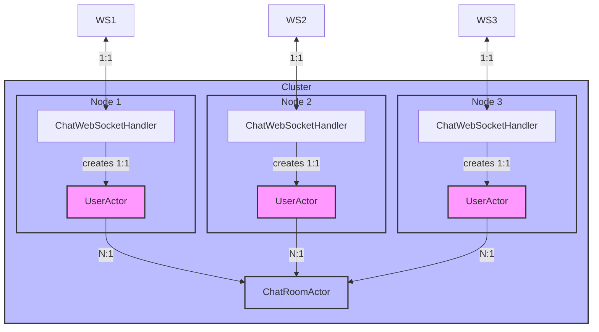

# Chat Application

This is a sample chat application built with Spring Boot and Pekko (a fork of Akka) for actor-based programming. It demonstrates how to use the Spring Boot Starter Actor library to build a reactive, clustered application.

## Architecture 



## Features

- Real-time chat using WebSockets
- Clustered architecture using Pekko
- Actor-based message handling
- Metrics collection and export

## Running Locally

You can run multiple instances of the application locally using the provided `cluster-start.sh` script:

```bash
./cluster-start.sh chat io.github.seonwkim.example.SpringPekkoApplication 8080 2551 3
```

This will start 3 instances of the application with the following configuration:
- Instance 1: HTTP port 8080, Pekko port 2551
- Instance 2: HTTP port 8081, Pekko port 2552
- Instance 3: HTTP port 8082, Pekko port 2553

## Running with Docker

Build and run the application using Docker:

```bash
# Build the Docker image from the project root
docker build -t chat-app:latest -f example/chat/Dockerfile .

# Run a container
docker run -p 8080:8080 -p 2551:2551 chat-app:latest
```
