# Chat Application

This is a sample chat application built with Spring Boot and Pekko (a fork of Akka) for actor-based programming. It demonstrates how to use the Spring Boot Starter Actor library to build a reactive, clustered application.

## Architecture

```mermaid
graph TB
    subgraph "Node 1"
        U1[UserActor 1]
        subgraph CR["ChatRoomActor"]
            T[Topic]
        end
    end

    subgraph "Node 2"
        U2[UserActor 2]
    end

    subgraph "Node 3"
        U3[UserActor 3]
    end

    WS1[🔌 WebSocket] --> U1
    WS2[🔌 WebSocket] --> U2
    WS3[🔌 WebSocket] --> U3

    U1 -.->|subscribe| T
    U2 -.->|subscribe| T
    U3 -.->|subscribe| T

    U1 -->|send message| CR
    T -->|broadcast| U1
    T -->|broadcast| U2
    T -->|broadcast| U3

    style CR fill:#8B5CF6,stroke:#7C3AED,color:#fff
    style T fill:#A78BFA,stroke:#8B5CF6,color:#fff
    style U1 fill:#06B6D4,stroke:#0891B2,color:#fff
    style U2 fill:#06B6D4,stroke:#0891B2,color:#fff
    style U3 fill:#06B6D4,stroke:#0891B2,color:#fff
```



## Features

- Real-time chat using WebSockets
- Clustered architecture using Pekko
- Actor-based message handling
- Metrics collection and export

## Running Locally

You can run multiple instances of the application locally using the provided `cluster-start.sh` script:

```bash
./cluster-start.sh chat io.github.seonwkim.example.SpringPekkoApplication 8080 2551 3
```

This will start 3 instances of the application with the following configuration:
- Instance 1: HTTP port 8080, Pekko port 2551
- Instance 2: HTTP port 8081, Pekko port 2552
- Instance 3: HTTP port 8082, Pekko port 2553

## Running with Docker

Build and run the application using Docker:

```bash
sh init-local-docker.sh
```

## Frontend Development

The chat application includes a modern React frontend located in the `frontend/` directory.

### Quick Start

```bash
# From the chat example directory
cd frontend

# Install dependencies (first time only)
npm install

# Start development server
npm run dev
```

The development server will start on `http://localhost:5173` with automatic proxy to the backend WebSocket.

### Building for Production

```bash
# Build React app (outputs to src/main/resources/static)
cd frontend
npm run build

# Then run the Spring Boot application
cd ..
./gradlew bootRun
```

The built frontend is automatically served by Spring Boot at `http://localhost:8080`

### Frontend Tech Stack

- **React 19** - Latest React with improved hooks and concurrency
- **TypeScript** - Type-safe development
- **Vite** - Lightning-fast HMR and builds
- **Tailwind CSS v4** - Utility-first styling
- **shadcn/ui** - Beautiful, accessible components
- **Lucide React** - Modern icon library

### Frontend Features

✅ **Online Presence** - See who's connected to the chat room
✅ **Real-time Messaging** - Instant message delivery via WebSocket
✅ **Connection Status** - Visual indicator of WebSocket connection
✅ **Auto-reconnect** - Automatic reconnection on disconnect
✅ **Responsive Design** - Works on desktop and mobile

See `frontend/README.md` for more details on the frontend architecture.
