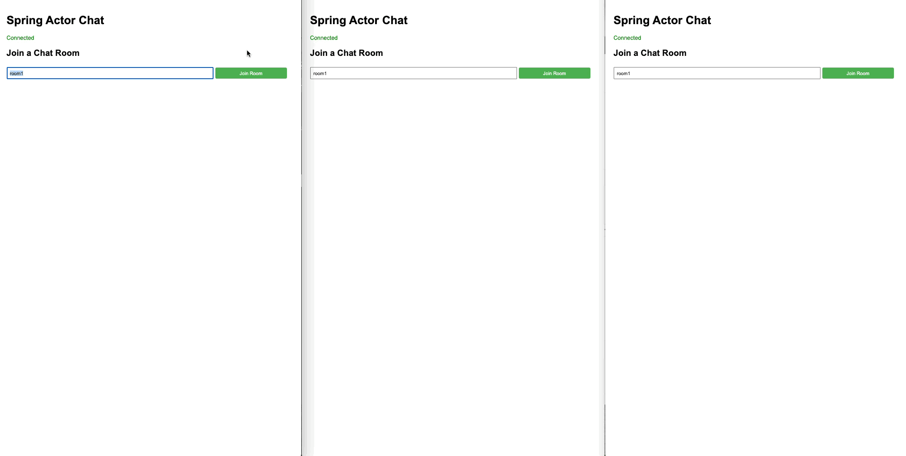

# Chat Example


This guide demonstrates how to build a real-time chat application using Spring Boot Starter Actor without introducing third-party middleware.

## Overview

The chat example shows how to:

- Build a real-time chat application using actors
- Implement WebSocket communication for real-time messaging
- Create a scalable, clustered chat system
- Eliminate the need for external message brokers or middleware

This example demonstrates how Spring Boot Starter Actor can be used to build real-world applications efficiently without relying on additional infrastructure components.

## Source Code

You can find the complete source code for this example on GitHub:
[https://github.com/seonWKim/spring-boot-starter-actor/tree/main/example/chat](https://github.com/seonWKim/spring-boot-starter-actor/tree/main/example/chat)

## Key Components

### ChatRoomActor

`ChatRoomActor` is a sharded actor that manages a chat room. Each chat room is a separate entity identified by a room ID. The actor maintains a list of connected users and broadcasts messages to all users in the room:

```java
@Component
public class ChatRoomActor implements ShardedActor<ChatRoomActor.Command> {

    public static final EntityTypeKey<Command> TYPE_KEY =
            EntityTypeKey.create(Command.class, "ChatRoomActor");

    /** Base interface for all commands that can be sent to the chat room actor. */
    public interface Command extends JsonSerializable {}

    /** Command to join a chat room. */
    public static class JoinRoom implements Command {
        public final String userId;
        public final ActorRef<UserActor.Command> userRef;

        @JsonCreator
        public JoinRoom(
                @JsonProperty("userId") String userId,
                @JsonProperty("userRef") ActorRef<UserActor.Command> userRef) {
            this.userId = userId;
            this.userRef = userRef;
        }
    }

    /** Command to leave a chat room. */
    public static class LeaveRoom implements Command {
        public final String userId;

        @JsonCreator
        public LeaveRoom(@JsonProperty("userId") String userId) {
            this.userId = userId;
        }
    }

    /** Command to send a message to the chat room. */
    public static class SendMessage implements Command {
        public final String userId;
        public final String message;

        @JsonCreator
        public SendMessage(
                @JsonProperty("userId") String userId, @JsonProperty("message") String message) {
            this.userId = userId;
            this.message = message;
        }
    }

    @Override
    public EntityTypeKey<Command> typeKey() {
        return TYPE_KEY;
    }

    @Override
    public Behavior<Command> create(EntityContext<Command> ctx) {
        return Behaviors.setup(
                context -> {
                    final String roomId = ctx.getEntityId();
                    return chatRoom(roomId, new HashMap<>());
                });
    }

    /**
     * Creates the behavior for a chat room with the given room ID and connected users.
     *
     * @param roomId The ID of the chat room
     * @param connectedUsers Map of user IDs to their actor references
     *
     * @return The behavior for the chat room
     */
    private Behavior<Command> chatRoom(
            String roomId,
            Map<String, ActorRef<UserActor.Command>> connectedUsers
    ) {
        return Behaviors.receive(Command.class)
                        .onMessage(
                                JoinRoom.class,
                                msg -> {
                                    // Add the user to the connected users
                                    connectedUsers.put(msg.userId, msg.userRef);

                                    // Notify all users that a new user has joined
                                    UserActor.JoinRoomEvent joinRoomEvent = new UserActor.JoinRoomEvent(
                                            msg.userId);
                                    broadcastCommand(connectedUsers, joinRoomEvent);

                                    return chatRoom(roomId, connectedUsers);
                                })
                        .onMessage(
                                LeaveRoom.class,
                                msg -> {
                                    // Remove the user from connected users
                                    ActorRef<UserActor.Command> userRef = connectedUsers.remove(msg.userId);

                                    if (userRef != null) {
                                        // Notify the user that they left the room
                                        UserActor.LeaveRoomEvent leaveRoomEvent = new UserActor.LeaveRoomEvent(
                                                msg.userId);
                                        userRef.tell(leaveRoomEvent);

                                        // Notify all remaining users that a user has left
                                        broadcastCommand(connectedUsers, leaveRoomEvent);
                                    }

                                    return chatRoom(roomId, connectedUsers);
                                })
                        .onMessage(
                                SendMessage.class,
                                msg -> {
                                    // Create a message received command
                                    UserActor.SendMessageEvent receiveMessageCmd =
                                            new UserActor.SendMessageEvent(msg.userId, msg.message);

                                    // Broadcast the message to all connected users
                                    broadcastCommand(connectedUsers, receiveMessageCmd);

                                    return Behaviors.same();
                                })
                        .build();
    }

    /**
     * Broadcasts a command to all connected users.
     *
     * @param connectedUsers Map of user IDs to their actor references
     * @param command The command to broadcast
     */
    private void broadcastCommand(Map<String, ActorRef<UserActor.Command>> connectedUsers,
                                  UserActor.Command command) {
        connectedUsers.values().forEach(userRef -> userRef.tell(command));
    }

    @Override
    public ShardingMessageExtractor<ShardEnvelope<Command>, Command> extractor() {
        return new DefaultShardingMessageExtractor<>(3);
    }
}
```

### UserActor

`UserActor` represents a connected user and handles sending messages to the user's WebSocket connection. It's implemented as a SpringActor that interacts with ChatRoomActor:

```java
@Component
public class UserActor implements SpringActor<UserActor, UserActor.Command> {

    public interface Command extends JsonSerializable {}

    public static class Connect implements Command {
    }

    public static class JoinRoom implements Command {
        private final String roomId;

        public JoinRoom(String roomId) {this.roomId = roomId;}
    }

    public static class LeaveRoom implements Command {
        public LeaveRoom() {}
    }

    public static class SendMessage implements Command {
        private final String message;

        public SendMessage(String message) {this.message = message;}
    }

    public static class JoinRoomEvent implements Command {
        private final String userId;

        public JoinRoomEvent(String userId) {this.userId = userId;}
    }

    public static class LeaveRoomEvent implements Command {
        private final String userId;

        public LeaveRoomEvent(String userId) {this.userId = userId;}
    }

    public static class SendMessageEvent implements Command {
        private final String userId;
        private final String message;

        public SendMessageEvent(String userId, String message) {
            this.userId = userId;
            this.message = message;
        }
    }

    public static class UserActorContext implements SpringActorContext {
        private final SpringActorSystem actorSystem;
        private final ObjectMapper objectMapper;
        private final WebSocketSession session;

        private final String userId;

        public UserActorContext(SpringActorSystem actorSystem, ObjectMapper objectMapper, String userId,
                              WebSocketSession session) {
            this.actorSystem = actorSystem;
            this.objectMapper = objectMapper;
            this.userId = userId;
            this.session = session;
        }

        @Override
        public String actorId() {
            return userId;
        }
    }

    @Override
    public Behavior<Command> create(SpringActorContext actorContext) {
        if (!(actorContext instanceof UserActorContext userActorContext)) {
            throw new IllegalStateException("Must be UserActorContext");
        }

        return Behaviors.setup(
                context -> new UserActorBehavior(
                        context,
                        userActorContext.actorSystem,
                        userActorContext.objectMapper,
                        userActorContext.userId,
                        userActorContext.session
                ).create()
        );
    }

    public static class UserActorBehavior {
        private final ActorContext<UserActor.Command> context;
        private final SpringActorSystem actorSystem;
        private final ObjectMapper objectMapper;

        private final String userId;
        private final WebSocketSession session;

        @Nullable
        private String currentRoomId;

        public UserActorBehavior(ActorContext<Command> context, SpringActorSystem actorSystem,
                               ObjectMapper objectMapper, String userId, WebSocketSession session) {
            this.context = context;
            this.actorSystem = actorSystem;
            this.objectMapper = objectMapper;
            this.userId = userId;
            this.session = session;
        }

        public Behavior<UserActor.Command> create() {
            return Behaviors.receive(Command.class)
                            .onMessage(Connect.class, this::onConnect)
                            .onMessage(JoinRoom.class, this::onJoinRoom)
                            .onMessage(LeaveRoom.class, this::onLeaveRoom)
                            .onMessage(SendMessage.class, this::onSendMessage)
                            .onMessage(JoinRoomEvent.class, this::onJoinRoomEvent)
                            .onMessage(LeaveRoomEvent.class, this::onLeaveRoomEvent)
                            .onMessage(SendMessageEvent.class, this::onSendMessageEvent)
                            .build();
        }

        private Behavior<Command> onConnect(Connect connect) {
            sendEvent(
                    "connected",
                    builder -> {
                        builder.put("userId", userId);
                    });

            return Behaviors.same();
        }

        private Behavior<Command> onJoinRoom(JoinRoom command) {
            currentRoomId = command.roomId;
            final var roomActor = getRoomActor();
            sendEvent(
                    "joined",
                    builder -> {
                        builder.put("roomId", currentRoomId);
                    });

            roomActor.tell(new ChatRoomActor.JoinRoom(userId, context.getSelf()));
            return Behaviors.same();
        }

        private Behavior<Command> onLeaveRoom(LeaveRoom command) {
            if (currentRoomId == null) {
                context.getLog().info("{} user has not joined any room.", userId);
                return Behaviors.same();
            }

            sendEvent(
                    "left",
                    builder -> {
                        builder.put("roomId", currentRoomId);
                    });

            final var roomActor = getRoomActor();
            roomActor.tell(new ChatRoomActor.LeaveRoom(userId));

            return Behaviors.same();
        }

        private Behavior<Command> onSendMessage(SendMessage command) {
            if (currentRoomId == null) {
                context.getLog().info("{} user has not joined any room.", userId);
                return Behaviors.same();
            }

            final var roomActor = getRoomActor();
            roomActor.tell(new ChatRoomActor.SendMessage(userId, command.message));

            return Behaviors.same();
        }

        private Behavior<Command> onJoinRoomEvent(JoinRoomEvent event) {
            sendEvent(
                    "user_joined",
                    builder -> {
                        builder.put("userId", event.userId);
                        builder.put("roomId", currentRoomId);
                    });
            return Behaviors.same();
        }

        private Behavior<Command> onLeaveRoomEvent(LeaveRoomEvent event) {
            sendEvent(
                    "user_left",
                    builder -> {
                        builder.put("userId", event.userId);
                        builder.put("roomId", currentRoomId);
                    });
            return Behaviors.same();
        }

        private Behavior<Command> onSendMessageEvent(SendMessageEvent event) {
            sendEvent(
                    "message",
                    builder -> {
                        builder.put("userId", event.userId);
                        builder.put("message", event.message);
                        builder.put("roomId", currentRoomId);
                    });
            return Behaviors.same();
        }

        private SpringShardedActorRef<ChatRoomActor.Command> getRoomActor() {
            return actorSystem.sharded(ChatRoomActor.class).withId(currentRoomId).get(); 
        }

        private void sendEvent(String type, EventBuilder builder) {
            try {
                ObjectNode eventNode = objectMapper.createObjectNode();
                eventNode.put("type", type);
                builder.build(eventNode);

                if (session.isOpen()) {
                    session.sendMessage(new TextMessage(objectMapper.writeValueAsString(eventNode)));
                }
            } catch (IOException e) {
                context.getLog().error("Failed to send message to WebSocket", e);
            }
        }

        @FunctionalInterface
        private interface EventBuilder {
            void build(ObjectNode node);
        }
    }
}
```

### ChatWebSocketHandler

`ChatWebSocketHandler` handles WebSocket connections and messages:

```java
@Component
public class ChatWebSocketHandler extends TextWebSocketHandler {

    private final ObjectMapper objectMapper;
    private final SpringActorSystem actorSystem;
    private final ConcurrentMap<String, SpringActorRef<UserActor.Command>> userActors =
            new ConcurrentHashMap<>();

    public ChatWebSocketHandler(
            ObjectMapper objectMapper, SpringActorSystem actorSystem) {
        this.objectMapper = objectMapper;
        this.actorSystem = actorSystem;
    }

    @Override
    public void afterConnectionEstablished(WebSocketSession session) {
        String userId = UUID.randomUUID().toString();
        session.getAttributes().put("userId", userId);
        UserActor.UserActorContext userActorContext =
                new UserActor.UserActorContext(actorSystem, objectMapper, userId, session);

        final SpringActorSpawnContext<UserActor, UserActor.Command> spawnContext =
                new SpringActorSpawnContext.Builder<>(UserActor.class)
                        .actorContext(userActorContext)
                        .build();

        actorSystem.actor(spawnContext)
                   .thenAccept(userActor -> {
                       userActors.put(userId, userActor);
                       userActor.tell(new Connect());
                   });
    }

    @Override
    protected void handleTextMessage(WebSocketSession session, TextMessage message) throws Exception {
        String userId = (String) session.getAttributes().get("userId");
        JsonNode payload = objectMapper.readTree(message.getPayload());
        String type = payload.get("type").asText();

        switch (type) {
            case "join":
                handleJoinRoom(userId, payload);
                break;
            case "leave":
                handleLeaveRoom(userId);
                break;
            case "message":
                handleChatMessage(userId, payload);
                break;
            default:
                sendErrorMessage(session, "Unknown message type: " + type);
        }
    }

    @Override
    public void afterConnectionClosed(WebSocketSession session, CloseStatus status) {
        final String userId = (String) session.getAttributes().get("userId");
        final var userActor = getUserActor(userId);
        if (userId != null && userActor != null) {
            userActor.stop();
            userActors.remove(userId);
        }
    }

    private void handleJoinRoom(String userId, JsonNode payload) {
        String roomId = payload.get("roomId").asText();
        final var userActor = getUserActor(userId);
        if (roomId != null && userActor != null) {
            userActor.tell(new JoinRoom(roomId));
        }
    }

    private void handleLeaveRoom(String userId) {
        final var userActor = getUserActor(userId);
        if (userActor != null) {
            userActor.tell(new LeaveRoom());
        }
    }

    private void handleChatMessage(String userId, JsonNode payload) {
        final var userActor = getUserActor(userId);
        String messageText = payload.get("message").asText();
        if (userActor != null && messageText != null) {
            userActor.tell(new SendMessage(messageText));
        }
    }

    private SpringActorRef<UserActor.Command> getUserActor(String userId) {
        if (userId == null) {
            return null;
        }

        return userActors.get(userId);
    }

    private void sendErrorMessage(WebSocketSession session, String errorMessage) {
        try {
            if (session.isOpen()) {
                ObjectNode response = objectMapper.createObjectNode();
                response.put("type", "error");
                response.put("message", errorMessage);
                session.sendMessage(new TextMessage(objectMapper.writeValueAsString(response)));
            }
        } catch (IOException e) {
            e.printStackTrace();
        }
    }
}
```

## Running the Application

### Local Cluster Setup

You can run multiple instances of the application locally using the provided `cluster-start.sh` script:

```bash
./cluster-start.sh chat io.github.seonwkim.example.SpringPekkoApplication 8080 2551 3
```

This will start 3 instances of the application with the following configuration:
- Instance 1: HTTP port 8080, Pekko port 2551
- Instance 2: HTTP port 8081, Pekko port 2552
- Instance 3: HTTP port 8082, Pekko port 2553

To stop the cluster:
```bash
./cluster-stop.sh
```

### Docker Deployment

You can also deploy the chat application as a clusterized app using Docker:

```bash
# Navigate to the chat example directory
cd example/chat

# Run the init-local-docker.sh script to build and deploy the application
sh init-local-docker.sh
```

This script will:

1. Build the chat application JAR file
2. Build a Docker image for the application
3. Deploy a 3-node Pekko cluster using Docker Compose
4. Each node will be accessible at:
   - Node 1: http://localhost:8080
   - Node 2: http://localhost:8081
   - Node 3: http://localhost:8082

#### Viewing Logs

To view logs for a specific node:
```bash
docker-compose logs -f chat-app-0
```

#### Stopping the Deployment

To stop the Docker deployment:
```bash
docker-compose down
```

The Docker deployment uses the same application code but configures it to run in a containerized environment, making it easier to deploy and scale in production scenarios.

## Architecture Benefits

This architecture eliminates the need for third-party middleware by leveraging:

- Built-in message routing between actors
- Natural state management within actors
- Scalability through sharded actors
- Real-time communication via WebSockets
- Fault tolerance provided by the actor system

## Key Takeaways

- The actor model provides an effective way to handle real-time communication
- WebSockets combined with actors create an efficient messaging system
