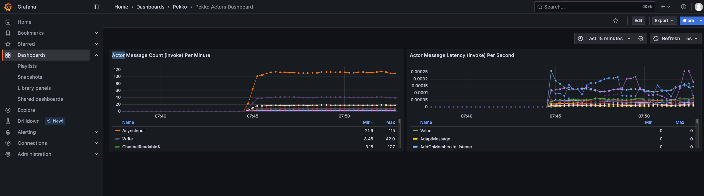

# Monitoring



This guide demonstrates how to set up and use the built-in monitoring capabilities of Spring Boot Starter Actor to observe and analyze your actor system's performance.

## Overview

The monitoring example shows how to:

- Set up a complete monitoring stack with Prometheus and Grafana
- Collect and export metrics from your actor system
- Visualize actor performance metrics in real-time
- Track message processing times and throughput
- Monitor cluster health and resource usage

Spring Boot Starter Actor provides comprehensive monitoring capabilities without requiring complex configuration or third-party services.

## Key Components

### Metrics Module

The Metrics module provides instrumentation for Pekko actors to collect performance metrics. It uses a Java agent to intercept method calls and capture timing information.

```java
// Include the Java agent when starting your application
java -javaagent:metrics-{version}-agent.jar -jar your-application.jar
```

### ActorInstrumentationEventListener

The `ActorInstrumentationEventListener` allows you to capture metrics about actor message processing:

```java
import io.github.seonwkim.metrics.ActorInstrumentationEventListener;
import io.github.seonwkim.metrics.ActorInstrumentationEventListener.InvokeAdviceEventListener;

// Register a listener for actor messages
ActorInstrumentationEventListener.register(new InvokeAdviceEventListener() {
    @Override
    public void onEnter(Envelope envelope) {
        // Called when a message is about to be processed
    }

    @Override
    public void onExit(Envelope envelope, long startTime, Throwable throwable) {
        // Called when message processing is complete
        // Calculate duration: System.nanoTime() - startTime
    }
});
```

### Metrics Exporter

The `ActorClusterMetricsExporter` shows how to export metrics to Prometheus via Micrometer:

```java
@Component
public class ActorClusterMetricsExporter {
    private final MeterRegistry registry;
    private final ConcurrentHashMap<String, Timer> invokeTimers = new ConcurrentHashMap<>();
    private final ConcurrentHashMap<String, Counter> invokeCounters = new ConcurrentHashMap<>();

    // Define which message types to track
    private final Set<Class<?>> targetClasses = Set.of(
        ChatRoomActor.JoinRoom.class,
        ChatRoomActor.LeaveRoom.class,
        ChatRoomActor.SendMessage.class
    );

    public ActorClusterMetricsExporter(MeterRegistry registry) {
        this.registry = registry;
    }

    @PostConstruct
    public void registerMetrics() {
        ActorInstrumentationEventListener.register(new InvokeAdviceEventListener() {
            @Override
            public void onEnter(Envelope envelope) {}

            @Override
            public void onExit(Envelope envelope, long startTime, Throwable throwable) {
                if (!targetClasses.contains(envelope.message().getClass())) {
                    return;
                }

                String messageType = envelope.message().getClass().getSimpleName();

                // Record timing metrics
                Timer timer = invokeTimers.computeIfAbsent(messageType, mt ->
                    Timer.builder("pekko.actorcell.invoke.timer")
                         .description("Time spent processing messages")
                         .tags("messageType", mt)
                         .register(registry)
                );

                // Record count metrics
                Counter counter = invokeCounters.computeIfAbsent(messageType, mt ->
                    Counter.builder("pekko.actorcell.invoke.count")
                           .description("Count of messages processed")
                           .tags("messageType", mt)
                           .register(registry)
                );

                long duration = System.nanoTime() - startTime;
                timer.record(duration, TimeUnit.NANOSECONDS);
                counter.increment();
            }
        });
    }
}
```

## Setting Up the Monitoring Stack

Spring Boot Starter Actor includes a ready-to-use monitoring stack with Prometheus and Grafana, managed via Docker Compose.

### 1. Start the Monitoring Stack

Navigate to the monitoring directory and start the stack:

```bash
cd scripts/monitoring
docker-compose up -d
```

This will start:
- Prometheus at http://localhost:9090
- Grafana at http://localhost:3000

### 2. Configure Your Application

Ensure your application exposes metrics via Spring Boot Actuator:

```yaml
# application.yaml
management:
  endpoints:
    web:
      exposure:
        include: health,info,prometheus
  metrics:
    export:
      prometheus:
        enabled: true
```

### 3. Access the Dashboards

Open Grafana at http://localhost:3000 (default credentials: admin/admin) to view the pre-configured dashboards.

### 4. Shutdown When Done

```bash
cd scripts/monitoring
docker-compose down -v
```

## Summary

- Collect performance data with the metrics module
- Visualize with Prometheus and Grafana
